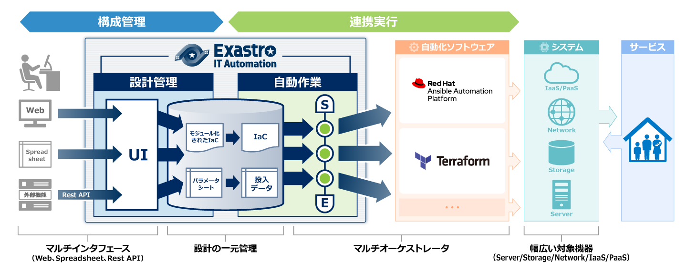

<link rel="stylesheet" href="assets/css/software_home.css?v=3">
<!--
##################################################
   Header
##################################################
-->
<header id="header">

    

        
システム<strong>設定</strong>に特化

        <h1 class="header-main-title">
            Exastro
            IT Automation Ver.2
        </h1>
        
Exastro IT Automation はシステム設定をデジタル化して一元管理するためのオープンソースのフレームワークです。

        

          
<i class="fas fa-download"></i> Easy to install...

          
<pre class="install-command ">sh &lt;(curl -sf https://ita.exastro.org/setup) install<i class="fa-regular fa-copy"></i></pre>

          
インストールの詳細については、<a class="install-command-link touch" href="https://ita-docs.exastro.org/2.1/ja/installation/">ドキュメント</a>を参照してください。

        

    

    

        <ul class="header-menu-list">
            <li class="header-menu-item"><a href="https://ita-docs.exastro.org/2.1/ja/installation/" class="header-link touch">
                <i class="fas fa-download"></i>
                Documents
                Install
            </a></li>
            <li class="header-menu-item"><a href="https://ita-docs.exastro.org/2.1/ja/manuals/" class="header-link touch">
                <i class="fas fa-file-alt"></i>
                Documents
                Manual
            </a></li>
            <li class="header-menu-item"><a href="https://ita-docs.exastro.org/2.1/ja/learn/quickstart/index.html" class="header-link touch">
                <i class="fa-solid fa-jet-fighter"></i>
                Learn
                Quickstart
            </a></li>
            <li class="header-menu-item"><a href="https://ita-docs.exastro.org/2.1/ja/learn/" class="header-link touch">
                <i class="fas fa-school"></i>
                Documents
                Learn
            </a></li>
            <!-- </a></li> -->
            <li class="header-menu-item">
                <i class="fas fa-video"></i>
                Webinar
                Coming Soon...
            </li>
            <li class="header-menu-item">
                <i class="fas fa-cog"></i>
                Setting Samples
                Coming Soon...
            </li>
            <li class="header-menu-item">
                <i class="fas fa-question-circle"></i>
                FAQ
                Coming Soon...
            </li>
        </ul>
    

</header>

<main id="main" style="overflow:hidden">
<article class="article">

<section id="overview" class="section">

    <h2 class="section-h2"><strong class="software-name">Exastro IT Automation</strong>とは？</h2>
    
Exastro IT Automation は、システム構築や運用業務の自動化/効率化/省力化を目的としたシステムの構成管理およびシステム設定のためのフレームワークです。

    <h3 class="section-h3">システム構築/運用は情報の一元管理が要！</h3>
    
Exastro IT Automation は、情報連携のミスやチーム間の情報伝達のコストを抑えるために、システムの構成情報であるパラメータや手順(IaC)を一元的に管理する仕組みを提供します。また、CMDB 上にシステムの過去・現在・未来のパラメータ情報を格納でき、作業手順書である IaC にパラメータを連携することで IaC の再利用性を高めることができます。

    <figure class="loupe touch"></figure>

</section>

<section id="version-update" class="section">

    <h2 class="section-h2">Ver. 2 で何が変わったのか？</h2>
    <h3 class="section-h3">マルチテナンシー対応</h3>
    
複数の組織やプロジェクトを1つの Exastro IT Automation 上にテナントとして管理できるため、コンピュータリソースを効率的に利用できます。また、データ領域はテナント毎に隔離されているため情報の機密性が保たれています。

    <h3 class="section-h3">ワークスペース機能</h3>
    
システムのパラメータ、設定ファイル、自動化ソフトウェアの IaC といった、システムを構成・管理・維持するための作業領域としてワークスペース機能を提供しています。このワークスペース機能を利用することで複数のシステム、または環境を容易に管理できます。

    <h3 class="section-h3">Restful API</h3>
    
すべての操作を Restful API で操作可能で周辺システムとの連携が容易です。

    <figure class="loupe touch"></figure>

</section>

<section id="resolve" class="section">

<h2 class="resolve-title"><strong class="software-name">Exastro IT Automation</strong>は システムの管理を取り巻く3つの問題を解決します</h2>

<ul class="resolve-problem-list">
    <li class="resolve-problem-item">
        <dl class="problem-list">
            <dt class="problem-title"><i class="fa-solid fa-xmark"></i>データ多重管理による 設計ミス</dt>
            <dd class="problem-resolve"><i class="fas fa-check-circle"></i>データを一括で管理、二重管理による設計ミスを防ぎます。</dd>
            <dd class="problem-image"><figure class="loupe touch"></figure></dd>
        </dl>
    </li>
    <li class="resolve-problem-item">
        <dl class="problem-list">
            <dt class="problem-title"><i class="fa-solid fa-xmark"></i>複雑な人手作業による オペレーションミス</dt>
            <dd class="problem-resolve"><i class="fas fa-check-circle"></i>構築作業は自動実行、実行状況をわかりやすく表示します。</dd>
            <dd class="problem-image"><figure class="loupe touch"></figure></dd>
        </dl>
    </li>
    <li class="resolve-problem-item">
        <dl class="problem-list">
            <dt class="problem-title"><i class="fa-solid fa-xmark"></i>作業記録不足による 障害対応遅延</dt>
            <dd class="problem-resolve"><i class="fas fa-check-circle"></i>作業記録をしっかりと管理、作業の成否をレポートします。</dd>
            <dd class="problem-image"><figure class="loupe touch"></figure></dd>
        </dl>
    </li>
</ul>

</section>

<!--<section id="features" class="section">

    <h2 class="features-h2"><strong>７</strong>つの特徴</h2>
    

        

            

                

                    
マルチテナントの実現

                    

                        
各メニューやレコード単位のRBACを活用することで、<em>マルチテナント</em>として活用いただくことが可能です。パラメータシートやJobFlowの<em>１つ１つに対して権限付与が可能</em>です。

                        
<figure class="loupe touch"></figure>

                    

                

            

            

                

                    
NoCodeでCMDBを定義

                    

                        
パラメータシートを<em>グラフィカル</em>に定義可能 
                        作成した<em>パラメータシートの関連性を可視化</em>できます。

                        
<figure class="loupe touch"></figure>

                    

                

            

            

                

                    
パラメータのライフサイクルを管理

                    

                        
収集⇒変更⇒収集⇒比較を一連のライフサイクルとして整備することで、変更すべき箇所が正しく変更できていることを確認することができる。

                        
<figure class="loupe touch"></figure>

                    

                

            

            

                

                    
IaCのCI/CDの実現

                    

                        
PlaybookやTFファイル等のIaCのCI/CDを実現する機能を具備。 
                        GitにIaCをコミットすることでMovement実行までを自動化することができる。

                        
<figure class="loupe touch"></figure>

                    

                

            

            

                

                    
IaCをモジュール管理して再利用性を向上

                    

                        
作成するIaCはなるべく使いまわせる粒度で作成することがIaC作成コストを低減させることにつながる。

                        
<figure class="loupe touch"></figure>

                    

                

            

            

                

                    
複数の自動化ソフトウェアを繋げて実行

                    

                        
<figure class="loupe touch"></figure>

                    

                

            

            

                

                    
実行状況をリアルタイムでモニタリング

                    

                        
<em>手動作業と比較して遜色なく実行状況をリアルタイム把握</em>することを重視 
                        また<em>実行記録（作業エビデンス）を管理</em>し欲しい時にダウンロード可能

                        

                    

                

            

        

        

            <ol class="features-list">
                <li class="features-item touch">
<i class="fas fa-cog"></i>マルチテナントの実現
</li>
                <li class="features-item touch">
<i class="fas fa-cog"></i>NoCodeでCMDBを定義
</li>
                <li class="features-item touch">
<i class="fas fa-cog"></i>パラメータのライフサイクルを管理
</li>
                <li class="features-item touch">
<i class="fas fa-cog"></i>IaCのCI/CDを実現
</li>
                <li class="features-item touch">
<i class="fas fa-cog"></i>IaCをモジュール管理して再利用性を向上
</li>
                <li class="features-item touch">
<i class="fas fa-cog"></i>複数の自動化ソフトウェアを繋げて実行
</li>
                <li class="features-item touch">
<i class="fas fa-cog"></i>実行状況をリアルタイムでモニタリング
</li>
            </ol>
        

    

</section>

<section id="applied" class="section">

    
Exastro IT Automation 応用1

    <h2 class="section-h2"><strong class="software-name">Exastro IT Automation</strong>が目指す システムライフサイクル</h2>
    <h3 class="section-h3">システムのインベントリ情報の取得と収集</h3>
    
自動化ソフトウェアの構築コードでインベントリ情報を取得すれば、それらのインベントリ情報はIT Automationに自動収集できます。IT資産管理にも活用して頂くことができます。

    <h3 class="section-h3">システムのインベントリ情報の妥当性をチェック</h3>
    
IT Automationはシステムに投入予定のパラメータを世代管理できます。そのため現時点でシステムに設定されているべきパラメータの期待値をパラメータの履歴から抽出が可能です。

    

    
現時点でシステムに設定されているべきパラメータの期待値と、システムから収集したインベントリ情報とを比較することで、システムのインベントリ情報の妥当性をチェックできます。

    <figure class="loupe touch"></figure>

</section>

<section id="cloudnative" class="section">

    
Exastro IT Automation 応用2

    <h2 class="section-h2">クラウドネイティブでの活用</h2>
    <h3 class="section-h3">あああああああああああああああああああああああ</h3>
    
あああああああああああああああああああああああああああああああああああああああああああああああああああああああああああああああああああああ

    <h3 class="section-h3">あああああああああああああああああああああああ</h3>
    
あああああああああああああああああああああああああああああああああああああああああああああああああああああああああああああああああああああ

    <figure class="loupe touch"></figure>

</section>-->

</article>
</main>
